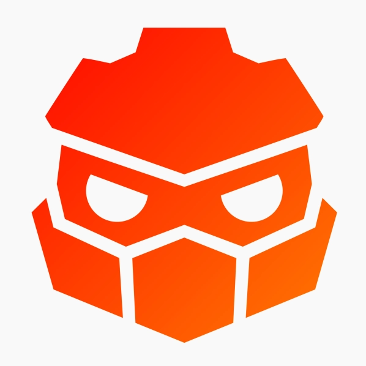

# Redot Engine

  

## Free and Open Source 2D and 3D cross-platform game engine

**[Redot Engine](https://Redotengine.org) is a Fork of Godot** With the goal of fulfilling the promise of godot.
We stand for promoting video games and the community, while keeping politics and religious views out.

## License

Redot is free and open source engine under the MIT license. This means as long as you keep
the original license, you are free to do whatever you like, distribute it, modify it, whatever.

## Community and contributing

Feel free to join the community!

[Discord](discord.gg/eWFDjKtd6G)

[Twitter/X](https://x.com/RedotEngine)

[Youtube](https://www.youtube.com/@RedotEngine)
