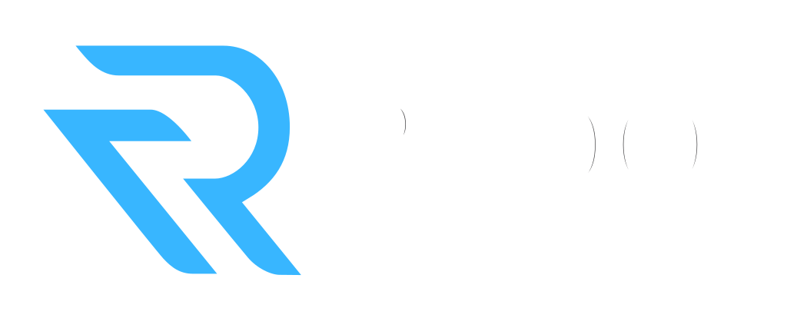

# Redot Engine

  

## 2D and 3D cross-platform game engine

**[Redot Engine](https://redotengine.org) is a feature-packed, cross-platform
game engine to create 2D and 3D games from a unified interface.** It provides a
comprehensive set of common tools, so that
users can focus on making games without having to reinvent the wheel. Games can
be exported with one click to a number of platforms, including the major desktop
platforms (Linux, macOS, Windows), mobile platforms (Android, iOS), as well as
Web-based platforms and consoles.

## Free, open source and community-driven

Redot is a completely free and open source fork of Godot under the very permissive MIT license.
No strings attached, no royalties, nothing. The users' games are theirs, down
to the last line of engine code. Redot's development is fully independent and truly
community-driven, empowering users to help shape their engine to match their
expectations.

Before being open sourced in [February 2014](https://github.com/godotengine/godot/commit/0b806ee0fc9097fa7bda7ac0109191c9c5e0a1ac),
Godot had been developed by [Juan Linietsky](https://github.com/reduz) and
[Ariel Manzur](https://github.com/punto-) (both still maintaining Godot)
for several years as an in-house engine, used to publish several work-for-hire
titles.

Redot is a fork therein of Godot, intending to improve upon Godot in order to fulfill its potential and contribute to the shared codebase of both via a more genuinely community-driven model than Godot.

## Getting the engine

### Binary downloads

Official binaries for the Redot editor and the export templates will be found
[on the Redot website](https://redotengine.org/download) once it's set up. They can be downloaded from the Action Artifacts summaries until then, though be warned that early test builds downloaded therein may be incomplete or buggy.

### Compiling from source

[For the time being, see the official Godot docs](https://docs.godotengine.org/en/latest/contributing/development/compiling)
for compilation instructions for every supported platform.

## Community and contributing

Redot is not only an engine but an ever-growing community of users and engine
developers. Please visit our [Discord server](https://discord.gg/redot)!

To get started contributing to the project, see the [contributing guide](CONTRIBUTING.md).
This document also includes guidelines for reporting bugs.

## Documentation and demos

The official documentation is maintained by the Redot community in its own [GitHub repository](https://github.com/redotengine/redot-docs).

The class reference is accessible from the Redot editor.

We also maintain official demos in their own [GitHub repository](https://github.com/redotengine/redot-demo-projects)
as well as a list of [awesome Redot community resources](https://github.com/redotengine/redot-awesome)
