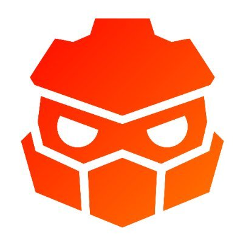

# Redot Engine

    

## 2D and 3D cross-platform game engine

**[Redot engine] is a feature-packed, cross-platform
game engine to create 2D and 3D games from a unified interface.** It provides a
comprehensive set of [common tools](https://godotengine.org/features), so that
users can focus on making games without having to reinvent the wheel. Games can
be exported with one click to a number of platforms, including the major desktop
platforms (Linux, macOS, Windows), mobile platforms (Android, iOS), as well as
Web-based platforms and [consoles](https://docs.godotengine.org/en/latest/tutorials/platform/consoles.html).

## Free, open source and community-driven

Redot is completely free and open source under the very permissive [MIT license](https://godotengine.org/license).
No strings attached, no royalties, nothing. The users' games are theirs, down
to the last line of engine code. Redot's development is fully independent and
community-driven, empowering users to help shape their engine to match their
expectations. 

## Getting the engine

### Binary downloads

Available soon!!

### Compiling from source

[See the official docs](https://docs.godotengine.org/en/latest/contributing/development/compiling)
for compilation instructions for every supported platform.

## Community and contributing

Redot is not only an engine but an ever-growing community of users and engine
developers. Chat with the community and with the core engine developers via [discord](https://discord.com/invite/redot).

To get started contributing to the project, see the [contributing guide](CONTRIBUTING.md).
This document also includes guidelines for reporting bugs.

## Documentation and demos

The official documentation is hosted on [Read the Docs](https://docs.godotengine.org).
It is maintained by the Redot community in its own [GitHub repository](https://github.com/Redot-Engine/redot-docs).

The [class reference](https://docs.godotengine.org/en/latest/classes/)
is also accessible from the Godot editor.

We also maintain official demos in their own [GitHub repository](https://github.com/Redot-Engine/redot-demo-projects)
as well as a list of [awesome Godot community resources](https://github.com/Redot-Engine/redot-awesome).

There are also a number of other
[learning resources](https://docs.godotengine.org/en/latest/community/tutorials.html)
provided by the community, such as text and video tutorials, demos, etc.
Consult the [discord server](https://discord.com/invite/redot)
for more information.

